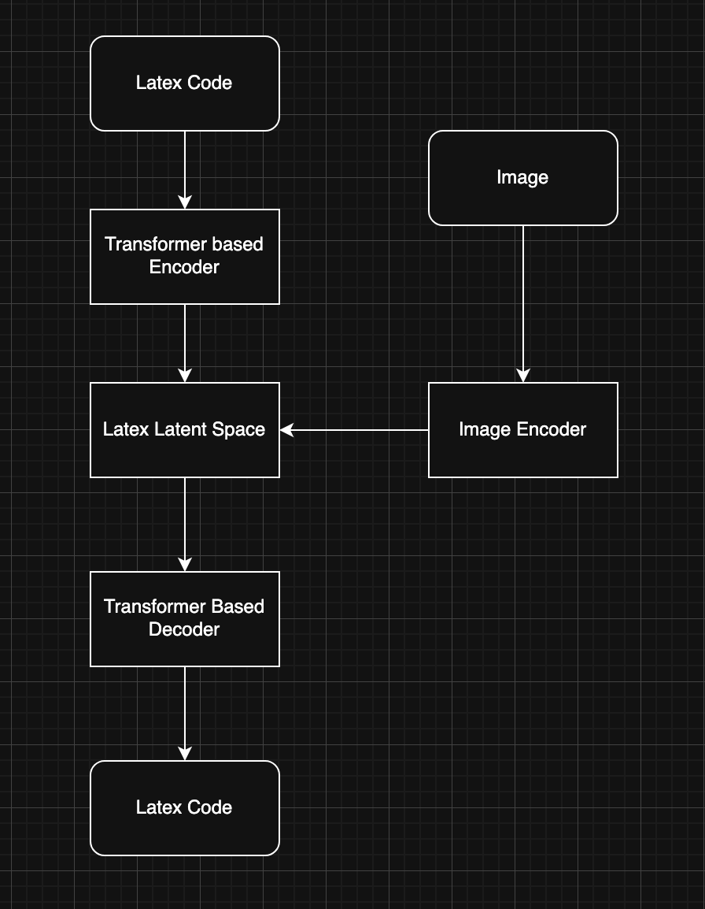

### IML Final Project

#### Introduction  
In this project we address the classic **Optical Character Recognition (OCR)** problem of converting images into their corresponding LaTeX markup. Beyond reproducing published methods, our goal is to experiment with innovative machine‑learning ideas. Prior work broadly falls into (1) *sequential prediction* models and (2) *encoder–decoder* frameworks.  
We focus on **Variational Autoencoders (VAEs)**: by training a VAE on *synthetic* images rendered from LaTeX expressions, where each image is paired with its generating code, we built a proof‑of‑concept system. After this stage the original text‑based encoder is replaced with an *image encoder*, allowing us to bridge from clean synthetic data to natural images.

---

### LaTeX‑VAE  

Variational Autoencoders are generative models that learn a latent distribution over data. An encoder maps an input $x$ to a latent vector $z$; a decoder reconstructs $x$ from $z$. Training maximises the evidence lower bound (ELBO):

$
\mathcal{L}(\theta,\phi;x)=
\mathbb{E}_{q_\phi(z\mid x)}\bigl[\log p_\theta(x\mid z)\bigr]-
D_{\mathrm{KL}}\!\bigl(q_\phi(z\mid x)\,\|\,p(z)\bigr).
$

We adopt a **Transformer‑VAE**, integrating the strong sequence‑modelling abilities of Transformers—essential for syntactic structures such as matching braces in LaTeX—into the VAE framework.

##### Implementation challenges  
* Handling **padding** correctly and designing an efficient decoder schedule were non‑trivial.  
* Initial mistake where the whole output was given to the decoder to condition on wasted approximately 7 hours of compute.
* Early experiments showed the model outputting padding tokens to minimise loss. We added:  
  * *Length penalty* to discourage excessive padding;  
  * *EOS penalty* to encourage proper sequence termination;  
  * *Diversity penalty* to reduce random high‑entropy outputs.  
* The latent distribution collapsed toward $\mathcal{N}(0,1)$; **β‑KL annealing** was introduced to stabilise training.

##### Results  
After ten epochs (≈ 7 h on a single NVIDIA A100) the training loss fell below $10^{-4}$. Reconstructions of held‑out training samples were visually and syntactically accurate.

##### Training Configuration
The Transformer-VAE implementation uses a vocabulary-based approach with special tokens for padding, sequence start, and end. The architecture consists of:
- A 128-dimensional latent space
- Transformer encoder-decoder with 512 dimensions, 8 attention heads, and 6 layers
- Maximum sequence length of 512 tokens
- Dropout rate of 0.2 for regularization

Training optimizations include mixed precision training, gradient clipping (1.0), and learning rate warmup (10% of total steps). The model uses a learning rate of 5e-5 with weight decay of 1e-2.

The loss function combines multiple components:
- Reconstruction loss for accurate LaTeX generation
- Length penalty to control sequence length
- EOS penalty to encourage proper sequence termination
- Diversity penalty to prevent mode collapse
- β-KL annealing for stable training

The image encoder processes inputs through a standard pipeline:
- Image resizing to 256x256
- ImageNet normalization
- Fixed vocabulary tokenization with special handling for out-of-vocabulary characters

Training progress is monitored through comprehensive logging, tracking reconstruction loss, KL divergence, and token distribution statistics.

---

### Image Encoder  

The auxiliary encoder must map images to the **LaTeX latent space (LLS)** learned by the VAE. Its loss mirrors the original ELBO:

$
\mathcal{L}(\psi; x')=
\mathbb{E}_{q_\psi(z\mid x')}[\log p_\theta(x'\mid z)]
-\beta\,D_{\mathrm{KL}}\!\bigl(q_\psi(z\mid x')\,\|\,p(z)\bigr),
$

where $p_\theta(x'\mid z)$ is the *fixed* pretrained decoder and $p(z)=\mathcal{N}(0,I)$.

We employ a **ResNet‑based CNN** that outputs the parameters of a Gaussian over the LLS. The architecture can later be upgraded (e.g. for handwritten data) without retraining the decoder.

##### Implementation details  
* An initial bug—computing RMS loss in kernel space—cost ≈ 18 h of GPU time.  
* Training for three epochs with RMS reconstruction + KL annealing yielded low loss but incoherent outputs.  
* We therefore introduced LaTeX‑specific auxiliary losses:  
  * **Command loss**: penalise incomplete commands (`\` without a token).  
  * **Brace loss**: enforce balanced `{}`.  
  * **Length penalty** and **EOS penalty** as above.

##### Training Configuration
The image encoder training process includes several key components:
- Batch size of 128 for stable gradient updates
- RMS reconstruction loss with KL annealing
- Learning rate warmup over initial training steps
- Comprehensive logging system with TensorBoard support
- Mixed precision training for improved efficiency
- Gradient clipping to prevent exploding gradients

The model architecture leverages the pretrained VAE's vocabulary and configuration:
- Fixed vocabulary from the LaTeX-VAE
- Maximum sequence length of 512 tokens
- Special token handling (`<pad>`, `<sos>`, `<eos>`)
- Out-of-vocabulary character mapping to padding

##### Results  
These domain‑specific losses improved syntactic correctness, yet outputs remain non‑compilable; further investigation is ongoing.

## Final Architecture Diagram

---

### Conclusion  
We demonstrated a two‑stage pipeline: a Transformer‑VAE that learns a robust latent representation of LaTeX, and an image encoder trained to project images into this latent space. While the text‑only VAE performs well, integrating the image encoder still poses challenges that future work must address.

---

